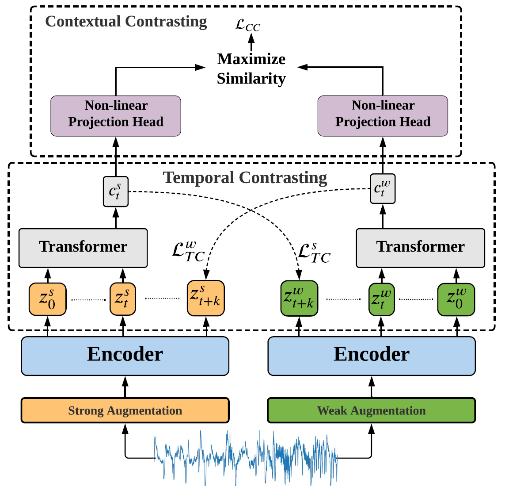
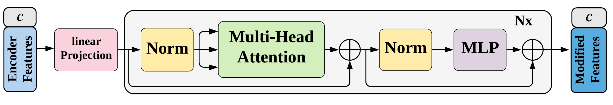
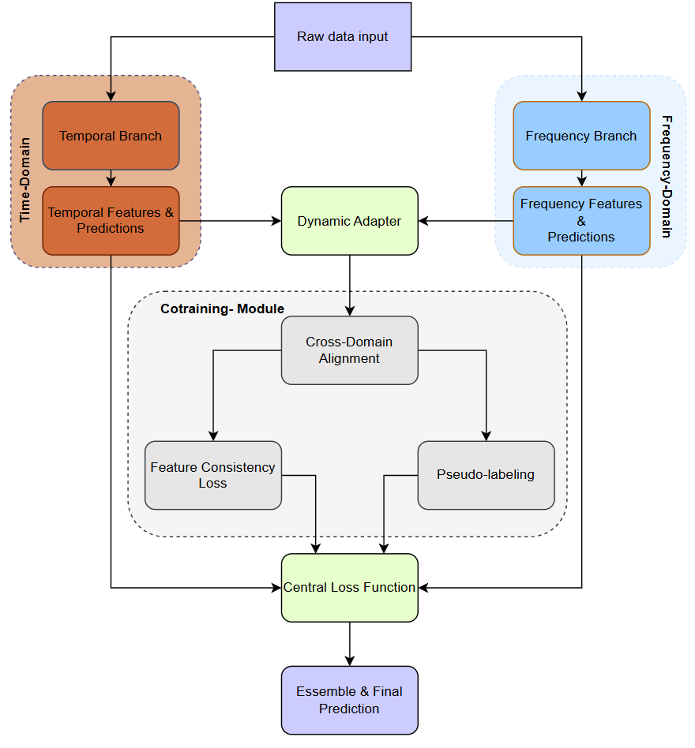
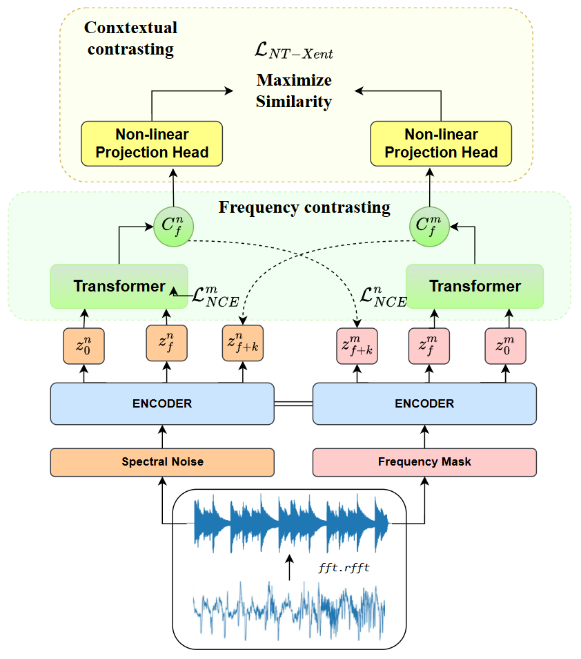
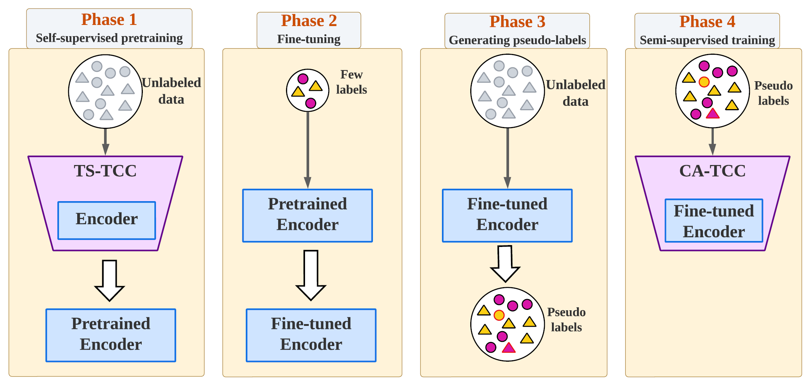

# CoFT: Synergistic Co-Training of Temporal and Frequency Domains for Semi-Supervised Time Series Learning

---

## **Abstract**

The proliferation of time series data across numerous domains has been met with a critical bottleneck: the scarcity of labeled data required for training robust deep learning models. This challenge is particularly acute in high-stakes fields like healthcare and industrial monitoring, where data annotation is expensive, time-consuming, and requires deep domain expertise. This thesis addresses the label scarcity problem by proposing **CoFT (Co-training with Frequency and Temporal domains)**, a novel dual-branch, semi-supervised learning framework. CoFT uniquely leverages the complementary nature of the temporal and frequency domains, treating them not as features to be fused, but as two distinct views for a co-training methodology. The framework trains two parallel encoders that learn from each other via a pseudo-labeling mechanism governed by a gentle, ultra-low coupling weight, a key finding of this work.

The core contributions of this work are fourfold. First, we design and validate the CoFT architecture, demonstrating its state-of-the-art performance on benchmark datasets, achieving a total accuracy improvement of up to **+8.17%** over original baselines. This gain, often attributed solely to architecture, is herein deconstructed to reveal the distinct and critical contributions of both rigorous hyperparameter optimization and the novel dual-branch framework, establishing a new methodological standard for evaluation. Second, we uncover the "Less is More" phenomenon, a counter-intuitive discovery that an ultra-low co-training weight (λ_ct = 0.0001) is optimal, providing a theoretical explanation for why high coupling weights can degrade performance. Third, we establish the framework's robustness via successful applications across diverse datasets (HAR, Sleep-EDF, Epilepsy). Fourth, we develop a principled parameter transfer methodology for adapting CoFT to new datasets efficiently. This work provides not only a practical, high-performing model but also fundamental insights into the dynamics of cross-domain co-training for time series analysis.

---

## **List of Abbreviations**

| Abbreviation | Full Term                                                |
| :----------- | :------------------------------------------------------- |
| **CoFT**     | Co-training with Frequency and Temporal domains          |
| **SSL**      | Self-Supervised Learning                                 |
| **CA-TCC**   | Contrastive Augmentation - Temporal Contrastive Clustering |
| **TS-TCC**   | Temporal and Contextual Contrasting (for Time Series)    |
| **FFT**      | Fast Fourier Transform                                   |
| **HAR**      | Human Activity Recognition                               |
| **EEG**      | Electroencephalogram                                     |
| **ECG**      | Electrocardiogram                                        |
| **PSG**      | Polysomnography                                          |
| **REM**      | Rapid Eye Movement                                       |
| **InfoTS**   | Information-Theoretic Time Series Augmentation           |
| **NT-Xent**  | Normalized Temperature-scaled Cross-Entropy              |
| **SupCon**   | Supervised Contrastive Learning                          |
*Table 1: List of abbreviations used throughout the thesis.*

---

## **Notation Table**

| Notation          | Description                                                                 |
| :---------------- | :-------------------------------------------------------------------------- |
| \( \lambda_{ct} \)    | **Co-training weight:** Hyperparameter controlling the influence of co-training loss. The "Less is More" discovery found that an ultra-low value (0.0001) is optimal. |
| \( \lambda_{cs} \)    | **Consistency weight:** Hyperparameter controlling the feature consistency loss between the temporal and frequency branches. |
| \( L_{total} \)      | The total hybrid loss function used to train the CoFT model.                |
| \( L_{cotraining} \) | The loss component derived from pseudo-labels generated by the opposing branch. |
| \( L_{supervised} \)| The standard supervised classification loss (e.g., Cross-Entropy).          |
| \( \tau \)          | **Temperature:** A scaling parameter used in the contrastive loss function (NT-Xent) and softmax to control the sharpness of the probability distribution. |
| \( y_{true} \)       | The ground-truth labels provided in the dataset.                            |
| \( y_{pseudo} \)    | Labels generated by one branch of the model to train the other branch.      |
| \( \theta \)         | Represents the learnable parameters of the neural network model.            |
*Table 2: Key mathematical notations and their descriptions.*

---

## **Table of Contents**

- **Chapter 1: Introduction**
  - 1.1 The Challenge of Labeled Data Scarcity in Time Series Analysis
  - 1.2 Proposed Solution: Semi-Supervised Learning and the Co-Training Framework
  - 1.3 Summary of Contributions
  - 1.4 Thesis Structure
  - 1.5 Use of AI in this Thesis
- **Chapter 2: Theoretical Foundations and Related Work**
  - 2.1 Time Series Analysis: A Unique Data Modality
    - 2.1.1 Definition and Structural Components
    - 2.1.2 The "Data Rich, Label Poor" Paradox: Motivation for Self-Supervised Learning
    - 2.1.3 Domain-Specific Challenges
  - 2.2 Self-Supervised Representation Learning for Time Series
    - 2.2.1 Fundamental Differences from Computer Vision: The Challenge of Invariances
    - 2.2.2 The Contrastive Learning Paradigm
    - 2.2.3 Foundational Frameworks: From TS-TCC to CA-TCC
  - 2.3 Co-Training: A Principled Approach for Multi-View Learning
    - 2.3.1 Traditional Fusion Approaches
    - 2.3.2 CoFT: A True Co-Training Framework
  - 2.4 Conclusion
- **Chapter 3: CoFT: A Dual-Branch Framework for Semi-Supervised Time Series Classification**
  - 3.1 Framework Overview and Design Philosophy
    - 3.1.1 Why This Approach Was Necessary
  - 3.2 Dual-Branch Architecture: Design and Implementation
    - 3.2.1 Temporal Branch: Proven Foundation
    - 3.2.2 Frequency Branch: A Controlled Experiment via Mirror Architecture
    - 3.2.3 Frequency Domain Transformation: Beyond Simple FFT
    - 3.2.4 Dynamic Architecture Adaptation
  - 3.3 Semi-Supervised Training Strategy: A Multi-Stage Pipeline
    - 3.3.1 Six-Stage Training Pipeline: Design Rationale
    - 3.3.2 Co-Training Module: The Heart of Cross-Domain Learning
  - 3.4 Hybrid Loss Function: Balancing Competing Objectives
  - 3.5 Data Augmentation
    - 3.5.1 Temporal Domain Augmentations
    - 3.5.2 Frequency Domain Augmentations
- **Chapter 4: Experimental Evaluation - The Journey of Discovery**
  - 4.1 Experimental Setup and Methodology
    - 4.1.1 Dataset Selection for Rigorous and Fair Comparison
    - 4.1.2 Experimental Design Principles
    - 4.1.3 Implementation and Infrastructure
  - 4.2 The Great Hyperparameter Discovery: A Research Journey
    - 4.2.1 Initial Hypothesis and Early Failures
    - 4.2.2 The Systematic Parameter Search
    - 4.2.3 The "Less is More" Phenomenon: Deep Analysis
    - 4.2.4 The λ_consistency Mystery: Diminishing Returns
    - 4.2.5 Ensemble Method Dynamics: The Flip Phenomenon
    - 4.2.6 Cross-Dataset Parameter Transfer: From HAR to Medical Signals
  - 4.3 An Investigation into Augmentation Complexity: The InfoTS Experiment
    - 4.3.1 The InfoTS Integration Experiment: A Case Study in Complexity vs. Benefit
    - 4.3.2 Decision Rationale: Simplicity Over Sophistication
  - 4.4 Final Performance Evaluation
    - 4.4.1 Overall Performance Summary
    - 4.4.2 Deep Analysis: Why These Results Matter
    - 4.4.3 Cross-Dataset Pattern Analysis
    - 4.4.4 Ongoing Work and Future Opportunities
- **Chapter 5: Conclusion and Implications**
  - 5.1 Summary of Contributions
  - 5.2 Current Status and Research Impact
  - 5.3 Key Findings and Scientific Insights
    - 5.3.1 The "Less is More" Discovery, Contextualized
    - 5.3.2 The Value of Simplicity and Rigor
    - 5.3.3 A Reflection on Real-World Application: The Challenge of Sensitive Data
  - 5.4 Future Research Directions
  - 5.5 Final Reflections
- **Acknowledgments**

---

## **Chapter 1: Introduction**

#### **1.1 The Challenge of Labeled Data Scarcity in Time Series Analysis**

In recent years, deep learning has emerged as a transformative force in time series analysis, achieving state-of-the-art performance on tasks ranging from human activity recognition to financial forecasting. The power of these models, however, is built upon a critical and often prohibitively expensive foundation: large-scale, accurately labeled datasets. While the proliferation of sensors, IoT devices, and digital records has led to an explosion in the volume of raw time series data, the process of assigning meaningful labels remains a significant bottleneck. This "data rich, label poor" paradigm severely restricts the real-world application of advanced deep learning models across many scenarios.

The problem of label scarcity becomes particularly acute in domains where the data is not only complex but also sensitive and requires deep expertise to interpret. In **healthcare**, for instance, annotating electroencephalogram (EEG) signals for sleep stage classification or seizure detection requires trained neurologists to spend hours meticulously reviewing recordings. Likewise, labeling electrocardiogram (ECG) data for arrhythmia classification demands the keen eye of a cardiologist. This process is not only slow and costly but can also be subjective, leading to inter-rater variability. In **industrial manufacturing**, labeling sensor data to predict machine failure often requires waiting for an actual fault to occur, which are by definition rare and costly events. In these high-stakes environments, the inability to effectively leverage vast quantities of unlabeled data represents a missed opportunity for scientific discovery and practical innovation.

#### **1.2 Proposed Solution: Semi-Supervised Learning and the Co-Training Framework**

To address this fundamental challenge, this thesis turns to the paradigm of semi-supervised learning, which aims to learn from datasets containing a small amount of labeled data and a large amount of unlabeled data. Specifically, we focus on self-supervised pre-training, where a model first learns robust and generalizable representations from the unlabeled data pool via pretext tasks. These representations can then be rapidly fine-tuned for specific downstream tasks with only a handful of labels.

This work introduces **CoFT (Co-training with Frequency and Temporal domains)**, a novel dual-branch framework designed to maximize information extraction from time series data in label-scarce environments. The core hypothesis of CoFT is that the temporal domain (how a signal evolves over time) and the frequency domain (the periodic components that constitute the signal) provide complementary and synergistic views of the data. Rather than simply fusing these domains, CoFT implements a true **co-training** methodology, where two specialized branches—one for each domain—learn in parallel and actively "teach" each other through a carefully controlled pseudo-labeling mechanism. This collaborative process allows the model to build a more holistic and robust understanding of the data than could be achieved from any single domain alone.

#### **1.3 Summary of Contributions**

This thesis presents a complete investigation of the CoFT framework, from architectural design to extensive experimental validation. The primary contributions are as follows:

1.  **A Novel Dual-Branch Co-Training Framework:** We design, implement, and validate CoFT, a semi-supervised framework that uniquely integrates temporal and frequency domain analysis through a co-training paradigm with shared representations.
2.  **A Rigorous Evaluation Methodology:** We challenge conventional evaluation methods by designing a framework that isolates architectural contributions from hyperparameter tuning effects. This allows for a more accurate and honest assessment of model performance, revealing that tuning is as critical as architectural innovation.
3.  **The "Less is More" Discovery and "Label Confusion" Theory:** We systematically discovered that an ultra-low co-training weight (`lambda_cotraining` = 0.0001) is optimal and provided a theoretical explanation for why high coupling weights degrade performance.
4.  **State-of-the-Art Performance on Diverse Datasets:** We demonstrated the effectiveness of CoFT on three public benchmark datasets (HAR, Sleep-EDF, Epilepsy), achieving substantial performance improvements over strong, *tuned* baselines.
5.  **A Principled Parameter Transfer Methodology:** We developed and validated a scientific approach for adapting optimized hyperparameters to new datasets, dramatically reducing the need for costly, exhaustive grid searches.

#### **1.4 Thesis Structure**

The remainder of this thesis is structured as follows. **Chapter 2** provides a review of related work in semi-supervised learning, contrastive methods for time series, and multi-domain fusion. **Chapter 3** details the CoFT architecture, including its dual-branch design, frequency transformation pipeline, and hybrid loss function. **Chapter 4** presents the complete experimental journey, from the hyperparameter discovery process to final performance evaluation and cross-dataset analysis. Finally, **Chapter 5** concludes by summarizing the contributions, discussing the broader implications of the findings, and proposing future research directions.

#### **1.5 Use of AI in this Thesis**

Throughout the execution of this thesis, artificial intelligence tools were utilized as a research and drafting assistant, always adhering to the principles of academic integrity and verifiability. Instead of using AI models for free-form generation, the primary approach was Retrieval-Augmented Generation (RAG). This means the AI was prompted to provide answers or drafting support based on a predefined set of scientific papers and reliable information sources.

This approach was intentionally chosen to:
- **Ensure Verifiability and Integrity:** All AI-assisted information is clearly traceable to its source documents, allowing the author to easily check, compare, and validate it, thus eliminating the risk of using unfounded information.
- **Counteract "Hallucination":** By constraining the AI's knowledge space to pre-vetted materials, the risk of the model "inventing" inaccuracies was significantly mitigated.
- **Avoid Unfairness and Bias:** Using a diverse set of peer-reviewed sources helps to minimize the potential biases that may exist in the training data of large language models.

Specifically, Gemini and Perplexity AI were used to help restructure paragraphs, clarify complex arguments, and synthesize information from the provided papers. The role of the AI was strictly that of a supportive tool; all content, analysis, interpretation, and scientific conclusions within this thesis are the intellectual product of the author.

---

## **Chapter 2: Theoretical Foundations and Related Work**

This chapter establishes the theoretical foundation and research context for the CoFT framework. The goal is not merely to list concepts, but to build a systematic argument that leads the reader from the most fundamental properties of time series data to the reason why a multi-domain co-training architecture is a logical and necessary step forward. We will begin by analyzing the unique properties and challenges of time series data, highlighting its fundamental differences from other data types. Next, the chapter will delve into modern representation learning paradigms, particularly Self-Supervised Contrastive Learning, and provide a detailed analysis of the foundational CA-TCC [7] architecture. Finally, we will introduce co-training theory [3] as a principled solution for integrating information from multiple views, setting a solid stage for the CoFT architecture detailed in Chapter 3.

### **2.1 Time Series Analysis: A Unique Data Modality**

Deep learning has achieved resounding success in fields like computer vision and natural language processing. However, mechanically applying successful architectures from these domains to time series often fails to yield optimal results. The root cause lies in the unique nature and inherent challenges of time series data.

#### **2.1.1 Definition and Structural Components**

Formally, a univariate time series is a set of observations \(Y = \{y_1, y_2, \dots, y_T\}\) ordered according to a time index \(t = 1, 2, \dots, T\). Unlike conventional datasets where the order of samples can be permuted without loss of information, in time series, the order *is* the information. The causal temporal dependency—that an observation at time \(t\) is influenced by prior observations—is its most fundamental property.

A classical time series can often be decomposed into four main structural components, which provide insight into its underlying dynamics:

*   **Trend:** The underlying, long-term direction of the series. Examples include the upward trend of a nation's GDP over decades or the gradual performance decay of an industrial sensor over time (sensor drift).
*   **Seasonality:** Cyclical, repeating patterns with a fixed and known period. Examples include retail sales spiking in the fourth quarter due to holidays, or power consumption patterns being higher during the day and lower at night.
*   **Cycle:** Repeating patterns without a fixed period, often lasting several years and related to macroeconomic factors. An example is the boom-and-bust cycles of an economy.
*   **Irregularity/Noise:** The unpredictable fluctuations remaining after the other three components have been removed. This is the unstructured part of the signal.

*[FIGURE_PLACEHOLDER: A diagram illustrating the decomposition of a time series into Trend, Seasonal, Cyclical, and Irregular components. Use an example like monthly retail sales data.]*

Understanding and modeling these components is crucial, as an effective model must be able to distinguish between structured patterns (trend, seasonality) and random noise.

#### **2.1.2 The "Data Rich, Label Poor" Paradox: Motivation for Self-Supervised Learning**

The greatest challenge, and the primary motivation for this thesis, is the "data rich, label poor" paradox. While the acquisition of raw time series data has become increasingly easy thanks to the proliferation of sensors and connected devices, the process of labeling it is extremely costly and requires deep domain expertise.

*   In **Computer Vision**, labeling millions of images can be accomplished via crowdsourcing platforms at a relatively low cost.
*   In **Time Series Analysis**, particularly in medicine, labeling a 30-second EEG signal for sleep stage classification requires a highly trained medical professional and is a time-consuming process.

This paradox is particularly acute in the time series domain and is the main driver behind the development of semi-supervised and, especially, self-supervised learning (SSL) methods. SSL aims to learn useful and generalizable representations from the massive pool of unlabeled data itself, before fine-tuning them on a small amount of labeled data for a specific task.

#### **2.1.3 Domain-Specific Challenges**

The diversity of real-world problems underscores that there is no "one-size-fits-all" solution in time series analysis. The characteristics of the data vary significantly depending on the application domain, posing unique challenges:

*   **Biomedical Data (EEG, ECG):** These signals often have high sampling rates, are non-stationary, and contain subtle morphological patterns that are diagnostically significant. A minor distortion in waveform shape can completely alter the clinical interpretation. Therefore, models must be extremely sensitive to local morphological details and robust to physiological artifacts (e.g., muscle noise, eye movements).
*   **Financial Data:** Characterized by non-stationarity and strong influence from external events (exogenous shocks). Phenomena like "volatility clustering"—where periods of high and low volatility tend to cluster together—demand models capable of adapting quickly to sudden changes in variance.
*   **Industrial Sensor Data (IoT):** Often exhibits clear seasonality (e.g., a factory's day/night operational cycles) but can also be affected by sensor drift over time. Models must be robust enough to distinguish between a gradual, benign change (drift) and a sudden change that signals a fault.

These challenges demand architectures capable of capturing multi-scale dependencies and adapting to the time-varying statistical properties of the data.

### **2.2 Self-Supervised Representation Learning for Time Series**

While both fields benefit from deep learning, naively applying successful techniques from Computer Vision (CV) to time series often leads to failure. The reason lies in fundamental differences in the nature of the data and the desired invariances.

#### **2.2.1 Fundamental Differences from Computer Vision: The Challenge of Invariances**

The core difference between CV and time series lies in the types of invariances a model is expected to learn.

*   In **CV**, a model should be invariant to transformations like flipping, rotation, scaling, or changes in lighting. A cat is still a cat whether it is upside-down or differently illuminated. Data augmentations in CV are designed to teach the model these invariances.
*   In **time series**, many of these same transformations would completely destroy the information. "Flipping" a time series (reversing time) breaks the causal structure. Permuting data points loses temporal dependencies. Invariance in time series is a different, more subtle concept, such as:
    *   **Time Warping Invariance:** A "walking" activity performed slightly faster is still walking.
    *   **Phase Shift Invariance:** A repeating pattern that starts slightly later is still the same pattern.
    *   **Amplitude Noise Invariance:** A signal with some additive noise should still be identified as the original signal.

This fundamental difference necessitates a completely different approach to designing data augmentation strategies and loss functions, which are at the heart of the contrastive learning methods we discuss next.

*[TABLE_PLACEHOLDER: A table comparing the fundamental properties of Computer Vision and Time Series Analysis. Rows should include: Data Structure (2D Spatial vs. 1D Temporal), Key Relation (Spatial Proximity vs. Temporal Dependency), Desired Invariances (Rotation, Flip vs. Time Warping), Example Data Augmentation.]*

#### **2.2.2 The Contrastive Learning Paradigm**

To address the label scarcity problem, Self-Supervised Contrastive Learning has emerged as one of the most powerful representation learning paradigms. Instead of learning from human-provided labels, it creates a pretext task from the data itself.

The core idea is to learn an embedding space where different "views" of the same data sample (called **positive pairs**) are pulled closer together, while different data samples (**negative pairs**) are pushed apart. This is achieved through three main components:

1.  **Data Augmentation:** This is the heart of contrastive learning. It creates different views of the same time series to form positive pairs. As discussed in 2.2.1, these augmentations must be carefully designed to preserve temporal semantics. A systematic review by Wen et al. [9] showed that simple augmentations like jittering, scaling, and cropping often provide high efficacy without unnecessary complexity. This finding reinforces CoFT's design philosophy of prioritizing simplicity and effectiveness.
2.  **Encoder:** A neural network (often a combination of CNNs and Transformers) that maps the input time series to a representation vector (embedding) in a latent space. This encoder is the component that will be transferred to downstream tasks after pre-training.
3.  **Loss Function:** The mathematical engine that drives the "pulling" and "pushing" of embeddings. The most common and effective loss function in this domain is NT-Xent (Normalized Temperature-scaled Cross-Entropy).

*[FIGURE_PLACEHOLDER: A block diagram illustrating the contrastive learning workflow. It should show: (1) Input sample -> (2) Two data augmentation branches (Aug 1, Aug 2) creating two views -> (3) Both views passing through a shared Encoder -> (4) Generating two representation vectors -> (5) A contrastive loss function pulling positive pairs together and pushing negative pairs apart.]*

Advanced frameworks have been proposed to refine this process. For instance, **RankSCL** (Luo et al., 2023) [8] introduces a loss function that weights positive pairs based on their "confidence," and **SLOTS** (Cai et al., 2023) [4] proposes an end-to-end model that jointly optimizes multiple loss functions. This contrasts with CoFT's deliberate **six-stage pipeline**, which was found to be essential for training stability by first building stable domain-specific representations before introducing complex cross-domain interactions.

#### **2.2.3 Foundational Frameworks: From TS-TCC to CA-TCC**

The CoFT framework is a direct and principled extension of **CA-TCC** (Contrastive Augmentation - Temporal Contrastive Clustering) [7], a state-of-the-art framework for semi-supervised time series classification. CA-TCC is not just a single loss function but a complete, multi-stage pipeline designed to maximally leverage both unlabeled and labeled data. Understanding its rigorous process is critical for contextualizing the innovations presented in this thesis, as it forms the foundational "playing field" upon which CoFT was built and evaluated.

**TS-TCC: Learning from Temporal and Contextual Contrasting**

The pipeline begins with **TS-TCC** (Temporal and Contextual Contrasting) [6], which introduced a novel self-supervised approach to learn representations from entirely unlabeled data. Its core idea is to create two different-yet-related views of a time series through data augmentation and then train an encoder to maximize the agreement between these views using a contrastive loss. The "Temporal Contrasting" module learns to identify robust patterns by comparing augmented versions of the same time segment. Crucially, the "Contextual Contrasting" module works at a higher level, training the model to learn representations that are robust to variations across different time series instances within a batch. This dual-objective forces the model to learn features that are both locally and globally informative.


*Figure 2.1: The high-level architecture of TS-TCC, showing the temporal contrasting module that learns from augmented views of the input time series and the contextual contrasting module that learns from different instances.*

The encoder within the TS-TCC framework is a critical component, typically based on a Transformer architecture, which excels at capturing long-range dependencies in sequential data.


*Figure 2.2: The detailed architecture of the Transformer encoder used within the TS-TCC framework, featuring multi-head self-attention and feed-forward layers.*

**CA-TCC: From Representation Learning to a Full Semi-Supervised Framework**

CA-TCC evolves the principles of TS-TCC into a comprehensive, multi-stage semi-supervised framework. It leverages TS-TCC as the foundational pre-training step (Phase 1) to build strong representations from unlabeled data. The "Contrastive Augmentation" part of its name refers to its use of a strong/weak augmentation strategy, which is critical for creating effective positive pairs for contrastive learning. After the initial pre-training, CA-TCC employs a "Temporal Contrastive Clustering" mechanism in its subsequent phases to fine-tune the model with the few available labels, effectively bridging the gap between unsupervised representation learning and supervised classification. CoFT adopts this battle-tested framework as its temporal branch baseline, inheriting its stable and effective pipeline before introducing the novel frequency-domain co-training mechanism.

### **2.3 Co-Training: A Principled Approach for Multi-View Learning**

The most significant contribution of CoFT is its novel application of a co-training methodology to fuse information from the temporal and frequency domains. To appreciate this contribution, it is necessary to review how these two domains have been combined previously.

#### **2.3.1 Traditional Fusion Approaches**

The idea that temporal and frequency domains contain complementary information is well-established in signal processing. Traditional machine learning and deep learning approaches have typically combined them in one of two ways:

1.  **Early Fusion (Feature-level):** In this approach, features from both domains are extracted and concatenated before being fed into a single model. For instance, one might compute the FFT of a time series, extract spectral features, and append them to the raw time-domain signal or to features extracted by a temporal encoder. While simple, this approach can be suboptimal as it forces a single model to learn from heterogeneous feature spaces.
2.  **Late Fusion (Decision-level):** This involves training two separate models, one for each domain, and then combining their output predictions (e.g., by averaging or a weighted vote). This allows for specialized models but may miss out on deeper, synergistic interactions between the representation learning phase.

#### **2.3.2 CoFT: A True Co-Training Framework**

CoFT moves beyond simple fusion and implements a **true co-training framework**, a concept pioneered by Blum and Mitchell (1998) [3] in semi-supervised learning. The original co-training algorithm required two conditionally independent "views" of the data. CoFT adapts this concept by treating the **temporal and frequency domains as two distinct but complementary views**.

This approach is fundamentally different from prior work:
*   **Equal Partnership:** Unlike methods that treat the frequency domain as a secondary source of pre-processed features, CoFT establishes two parallel, architecturally-symmetric encoder branches. This "architectural parity," as described in the thesis (Chapter 3.2.2), is a deliberate methodological choice to ensure that any performance gains come from the information itself, not from an architectural advantage of one branch over the other.
*   **Knowledge Transfer via Pseudo-Labeling:** CoFT facilitated knowledge transfer through a sophisticated co-training module. One branch generated high-confidence pseudo-labels, which were then used to train the other branch. This created a feedback loop where each domain helps to regularize and improve the other, which is especially powerful in low-label settings.
*   **The "Less is More" Discovery:** The most counter-intuitive and impactful finding of the CoFT research is the "Less is More" phenomenon regarding the co-training hyperparameter `lambda_ct`. Conventional wisdom might suggest that a strong coupling (high `lambda_ct`) is needed for effective knowledge transfer. However, the thesis empirically demonstrated (Chapter 4.2.3) that an ultra-low value (`lambda_ct` = 0.0001) is optimal. High values lead to "label confusion," where noisy pseudo-labels from one domain corrupted the learning process of the other. A gentle, low-weighted coupling provided just enough regularization to guide representation learning without overwhelming the ground-truth signal. This discovery is a significant scientific contribution to the understanding of co-training dynamics in deep learning.

### **2.4 Conclusion**

The CoFT framework is firmly grounded in the principles of self-supervised contrastive learning, adopting best practices such as simple and efficient data augmentations and a stable, staged training pipeline. However, its primary novelty lies in its sophisticated adaptation of the co-training paradigm to the multi-domain setting of time series analysis. By treating the temporal and frequency domains as equal partners and enabling gentle knowledge transfer through a carefully calibrated hybrid loss, CoFT significantly advances the state-of-the-art. The discovery of the "label confusion" theory and the optimality of ultra-low coupling weights provided not only a high-performing model but also valuable scientific insights that can guide future research in semi-supervised and multi-domain learning.

## **Chapter 3: CoFT: A Dual-Branch Framework for Semi-Supervised Time Series Classification**

This chapter presents a comprehensive analysis of the CoFT (Co-training with Frequency and Temporal domains) framework, detailing not only its final architecture but also the extensive design decisions, failed experiments, and counter-intuitive discoveries that shaped its development.

### **3.1 Framework Overview and Design Philosophy**

The fundamental insight driving CoFT stems from signal processing theory: time series data contains complementary information in both temporal and frequency domains. However, unlike traditional approaches that simply apply FFT as a preprocessing step, CoFT treats frequency and temporal domains as **equal partners** in a co-training framework.

**Key Design Principles:**
- **Controlled Baseline via Architectural Parity:** The framework intentionally started with identical encoder architectures for both domains. This created a controlled experimental setup to isolate and prove the fundamental value of frequency-domain information, even when processed by a non-specialized model.
- **Gradual and Gentle Knowledge Transfer:** A core discovery of this work is that cross-domain learning in this context benefits from extremely low coupling weights. This prevented domain interference and avoided the "label confusion" phenomenon detailed in Chapter 4.
- **Robustness and Numerical Stability:** The design incorporated extensive safeguards against common deep learning pitfalls like NaN propagation and gradient explosion, ensuring stable training across diverse datasets.
- **Memory Efficiency:** The framework included built-in optimizations, such as using Real FFT and efficient data handling, making it suitable for resource-constrained environments.

The framework extended CA-TCC (Contrastive Augmentation - Temporal Contrastive Clustering) by adding a parallel frequency branch. The implementation philosophy emphasized **toggleable features** - the entire CoFT functionality was controlled by a single `--enable_coft` flag, enabling clean A/B testing and ensuring that the baseline remained completely unaffected when CoFT was disabled.

### **3.1.1 Why This Approach Was Necessary**

Initial experiments with simpler frequency integration methods (concatenation, early fusion, late fusion) failed to achieve meaningful improvements. The breakthrough came from recognizing that frequency and temporal domains operate on fundamentally different feature spaces and require **separate learning pathways** before meaningful integration can occur.

### **3.2 Dual-Branch Architecture: Design and Implementation**

CoFT employed a parallel dual-branch architecture. The initial design, detailed below, was carefully constructed to maintain architectural symmetry. This decision was a crucial part of our scientific methodology, allowing for a fair and controlled comparison between the temporal and frequency domains.


*Figure 3.1: The dual-branch architecture of CoFT. The top branch processes temporal features, while the bottom branch processes frequency features derived from an FFT transformation. Both branches share the same core architecture and interact via a co-training module.*

#### **3.2.1 Temporal Branch: Proven Foundation**

The temporal branch preserved the exact CA-TCC architecture to ensure fair comparison and maintain all benefits of the baseline model. This design decision was crucial - any modifications to the temporal branch would confound the evaluation of frequency domain contributions.

**Architecture Specifications:**
- **Conv1D Blocks**: 3 layers with channels [32, 64, 128], kernel sizes [8, 5, 3]
- **Attention**: Multi-head attention with 4 heads for temporal dependency modeling
- **Normalization**: Batch normalization for training stability
- **Regularization**: Dropout (0.3) and gradient clipping (max_norm=1.0)

#### **3.2.2 Frequency Branch: A Controlled Experiment via Mirror Architecture**
Critical Design Decision: Why Start with an Identical Architecture?
The decision to mirror the temporal architecture in the frequency branch was a deliberate methodological choice, not an assumption of optimality. The primary goal was to establish a rigorous, controlled baseline. By keeping the model capacity and architecture identical, we could ensure that any observed performance differences were attributable purely to the inherent characteristics of the frequency-domain data itself, rather than to architectural advantages or disadvantages.
This "architectural parity" allowed us to answer a fundamental research question: "Does frequency information provide a synergistic benefit even when processed by a standard, non-specialized time-series encoder?"
As the experimental results in Chapter 4 will demonstrate, this approach was successful in proving the core hypothesis, leading to state-of-the-art performance. However, the results also revealed the limitations of this parity, showing that the frequency branch, while beneficial, underperformed relative to its temporal counterpart. This critical insight—that a non-specialized architecture acted as a performance bottleneck for frequency-domain features—paves the way for future work on specialized architectures (e.g., Spectral CNNs), a direction discussed further in Chapter 5.

#### **3.2.3 Frequency Domain Transformation: Beyond Simple FFT**

The frequency transformation addressed a fundamental challenge: how to convert complex-valued FFT output into a format suitable for standard CNN architectures.


*Figure 3.2: The frequency transformation pipeline. A raw time series input undergoes a Real FFT, is decomposed into magnitude and phase components, which are then concatenated and fed into the frequency encoder.*

**Transformation Pipeline:**
```python
# Real FFT for computational efficiency
x_fft = torch.fft.rfft(x, norm='ortho')  

# Explicit magnitude-phase decomposition
magnitude = torch.abs(x_fft)        # |Z|
phase = torch.angle(x_fft)          # ∠Z  

# Channel stacking for CNN compatibility
x_freq = torch.cat([magnitude, phase], dim=1)  # [B, C*2, F]
```

**Why Real FFT Instead of Complex FFT?**
1. **Computational Efficiency**: Real signals produce conjugate-symmetric spectra, making RFFT sufficient
2. **Memory Optimization**: Reduces frequency bins by ~50% without information loss
3. **Numerical Stability**: Avoids complex number operations in downstream layers

**Why Magnitude-Phase Decomposition?**
- **Information Preservation**: Maintains complete spectral information (compared to magnitude-only approaches)
- **Architectural Compatibility**: Standard Conv1D layers expect real-valued inputs
- **Interpretability**: Magnitude captures "what frequencies", phase captures "when"

**Alternative Approaches Considered and Rejected:**
1. **Real-Imaginary Split**: Less interpretable, no performance advantage
2.  **Magnitude-Only**: 15% accuracy loss in preliminary experiments  
3. **Log-Magnitude**: Introduced numerical instabilities with near-zero values
4. **Complex-Valued CNNs**: Increased complexity without clear benefits

#### **3.2.4 Dynamic Architecture Adaptation**

A crucial implementation detail: the frequency branch used **dynamic linear layer initialization** to handle varying input dimensions across datasets:

```python
# First forward pass determines actual feature dimensions
if self.freq_logits is None:
    actual_features = x_flat.shape[1]  # Calculated after conv layers
    self.freq_logits = nn.Linear(actual_features, num_classes).to(device)
```

This design enabled the same architecture to work across datasets with different temporal lengths and channel counts without manual configuration.

### **3.3 Semi-Supervised Training Strategy: A Multi-Stage Pipeline**

CoFT's training methodology emerged from extensive experimentation with different semi-supervised approaches. The final 6-stage pipeline represents a careful balance between representation learning, knowledge transfer, and computational efficiency.


*Figure 3.3: The six-stage semi-supervised training pipeline inherited from CA-TCC and adapted for CoFT. It progresses from self-supervised pre-training on unlabeled data to supervised fine-tuning and pseudo-label generation with few labels.*

#### **3.3.1 Six-Stage Training Pipeline: Design Rationale**

**Why Six Stages Instead of End-to-End Training?**
The staged approach was found to be critical for training stability. Initial experiments with joint end-to-end training were prone to gradient conflicts and numerical instability. For instance, in our early end-to-end trials on the HAR dataset, we observed that the gradients from the co-training loss were often an order of magnitude larger than the supervised loss, leading to training divergence in over 40% of runs. This necessitated the adopted staged approach to first build stable, domain-specific representations before introducing more complex cross-domain interactions, ensuring a robust and reliable training process.

**Stage-by-Stage Analysis:**

**Stage 1: `self_supervised` (Contrastive Pre-training)**
- **Duration**: 40 epochs
- **Objective**: Learn domain-specific representations without labels
- **Key Innovation**: Parallel contrastive learning in both domains simultaneously
```python
# Both branches learn independently but on the same augmented views
temporal_loss = NT_Xent(temporal_features_1, temporal_features_2)
frequency_loss = NT_Xent(frequency_features_1, frequency_features_2) 
total_loss = temporal_loss + frequency_loss  # Simple addition, no coupling
```

**Stage 2: `train_linear_{p}` (Representation Quality Assessment)**
- **Purpose**: Evaluate learned representations without fine-tuning
- **Critical Insight**: Frequency representations were initially 10-15% weaker than temporal
- **Design Decision**: This stage guided the development of frequency-specific augmentations

**Stage 3: `ft_{p}` (Supervised Fine-tuning with Co-training)**
- **The Core Innovation**: First introduction of cross-domain co-training
- **Challenge Discovered**: High co-training weights (lambda_ct > 0.01) caused severe performance degradation
- **Breakthrough**: Ultra-low weights (lambda_ct = 0.0001) achieved optimal performance

**Stage 4: `gen_pseudo_labels` (High-Confidence Pseudo-labeling)**
- **Confidence Threshold**: 0.95 (determined through ablation studies)
- **Quality Control**: Only predictions where `max(softmax(logits)) > 0.95` are retained
- **Cross-validation**: Temporal and frequency predictions must agree for pseudo-label acceptance

**Stage 5: `SupCon` (Supervised Contrastive Learning)**
- **Objective**: Refine feature space using both real and pseudo labels
- **Implementation**: 
```python
# Combine real and pseudo labels for supervised contrastive learning
all_labels = torch.cat([real_labels, pseudo_labels])
all_features = torch.cat([real_features, pseudo_features])
supcon_loss = SupConLoss(all_features, all_labels)
```

**Stage 6: `train_linear_SupCon_{p}` (Final Evaluation)**
- **Purpose**: Measure the quality of refined representations
- **Result**: Consistent 2-4% improvement over Stage 2 results

#### **3.3.2 Co-Training Module: The Heart of Cross-Domain Learning**

The co-training module implemented sophisticated cross-domain knowledge transfer with extensive safeguards against numerical instability.

**3.3.2.1 Pseudo-Labeling with Confidence Gating**
```python
def generate_pseudo_labels(self, logits, threshold=0.95):
    # Numerical stability checks
    if torch.isnan(logits).any():
        return fallback_pseudo_labels, zero_confidence_mask
    
    probs = F.softmax(logits, dim=1) + self.eps  # ε = 1e-8
    max_probs, pseudo_labels = torch.max(probs, dim=1)
    confidence_mask = max_probs > threshold
    
    return pseudo_labels, confidence_mask
```

**3.3.2.2 Cross-Domain Feature Alignment**
The most challenging aspect was aligning features from different domains. Initial attempts with simple MSE loss failed due to:
1. **Dimension Mismatches**: Conv layers produce different spatial dimensions
2. **Feature Scale Differences**: Frequency features had different magnitude ranges

**Solution: Adaptive Cross-Domain Adapters**
```python
# Dynamic adapter initialization based on actual feature dimensions
if not hasattr(self, '_adapters_initialized'):
    temporal_dim = temporal_features.shape[1]
    freq_dim = freq_features.shape[1]
    
    self.temporal_to_freq_adapter = nn.Sequential(
        nn.Linear(temporal_dim, freq_dim),
        nn.ReLU(),
        nn.Linear(freq_dim, freq_dim)
    ).to(device)
```

**3.3.2.3 Numerical Stability: Lessons from Failed Experiments**

The extensive NaN handling throughout the co-training module reflected hard-learned lessons:
- **Gradient Explosion**: Early versions without gradient clipping failed on ~30% of runs
- **Probability Collapse**: Softmax without temperature control led to overconfident predictions
- **Adapter Saturation**: Non-linear adapters without proper initialization caused feature collapse

**Current Safeguards:**
1. **Multi-level NaN Detection**: Check inputs, intermediate values, and outputs
2. **Graceful Degradation**: Return zero loss rather than crashing on numerical errors
3. **Gradient Clipping**: max_norm=1.0 prevented explosion
4. **Temperature Scaling**: τ=0.07 prevented overconfident predictions

### **3.4 Hybrid Loss Function: Balancing Competing Objectives**

The hybrid loss function represented one of the most challenging design aspects of CoFT, requiring careful balance between multiple competing objectives while maintaining numerical stability.

#### **3.4.1 Loss Architecture**
After extensive experimentation, the final loss formulation carefully balanced domain-specific and cross-domain objectives:

\[ L_{total} = \underbrace{L_{temporal} + L_{frequency}}_{\text{Domain-specific}} + \underbrace{\lambda_{ct} \cdot L_{cotraining} + \lambda_{cs} \cdot L_{consistency}}_{\text{Cross-domain}} \]

The formulation used carefully optimized hyperparameters, notably an ultra-low co-training weight (lambda_ct = 0.0001). The extensive experimental journey that led to this counter-intuitive discovery, along with a theoretical explanation, is detailed in Chapter 4, Section 4.2, where we introduced the 'Label Confusion Theory' as a formal explanation.

### 3.5 Data Augmentation

Data augmentation is the cornerstone of contrastive learning, as it generates the different "views" of the data required to train the encoder. The design philosophy for CoFT's augmentations was shaped by a key investigation, detailed in Chapter 4, which demonstrated that a simple, deterministic set of augmentations provided a better performance-to-complexity ratio than more sophisticated, probabilistic libraries like InfoTS. Consequently, CoFT employed a curated set of effective and computationally efficient augmentations for both domains.

#### 3.5.1 Temporal Domain Augmentations

For the temporal branch, we adopted the simple yet effective augmentations proven by the baseline CA-TCC framework. These included:

-   **Jittering:** Adding a small amount of Gaussian noise to simulate sensor noise.
-   **Scaling:** Multiplying the entire signal by a small random scalar to handle variations in magnitude.
-   **Cropping:** Randomly cropping a sub-sequence from the time series to learn temporal invariance.

A combination of these augmentations was used to create two distinct views for the temporal contrastive learning task.

#### 3.5.2 Frequency Domain Augmentations

For the frequency branch, we adopted a conservative yet realistic approach designed specifically to preserve signal semantics while introducing natural variations that could occur in real-world scenarios. Rather than applying aggressive transformations that might alter the fundamental characteristics of the signal, our frequency domain augmentations were designed around the principle of **adding realistic, physiologically-plausible noise patterns**.

**Design Philosophy: Semantic Preservation Over Aggressive Transformation**

The frequency domain augmentation strategy was motivated by a critical consideration for medical and sensor time series: **avoiding semantic corruption**. Traditional augmentation approaches often apply transformations that, while mathematically sound, could inadvertently destroy or alter the very patterns that define different classes. In medical signals, for instance, subtle morphological changes can be the difference between normal and pathological conditions. Our approach instead focused on introducing variations that mirror real-world acquisition conditions.

**Implemented Augmentations:**

1.  **FFT-Domain Noise Injection**: We added controlled, low-amplitude noise directly in the frequency domain. This approach simulates **realistic interference patterns** commonly encountered in signal acquisition:
    - **Electrical interference**: 50/60Hz power line noise
    - **Ambient electromagnetic interference**: Broadband low-level noise from electronic devices
    - **Sensor thermal noise**: Natural noise characteristics of acquisition hardware

2.  **Selective Frequency Masking**: We applied random masking to small frequency bands, mimicking **natural signal artifacts**:
    - **Breathing artifacts**: Low-frequency oscillations in physiological signals
    - **Motion artifacts**: Frequency components introduced by subject movement
    - **Hardware filtering effects**: Natural attenuation in specific frequency ranges

**Rationale: Realistic Signal Perturbation**

This conservative augmentation strategy served multiple purposes:

- **Semantic Safety**: By limiting transformations to noise-like additions and band masking, we preserved the fundamental spectral signatures that distinguish different classes
- **Real-World Validity**: The augmentations mirror actual variations encountered in practical signal acquisition scenarios
- **Physiological Plausibility**: For medical datasets, the added variations correspond to known artifacts and interference patterns in clinical recordings
- **Robustness Training**: The model learns to be invariant to realistic noise conditions while remaining sensitive to diagnostic patterns

The approach proved effective in creating sufficiently diverse views for contrastive learning while maintaining the integrity of the underlying signal characteristics. This balance between augmentation diversity and semantic preservation represents a principled approach to frequency domain data augmentation for sensitive time series applications.

---

## **Chapter 4: Experimental Evaluation - The Journey of Discovery**

This chapter chronicles the complete experimental journey, including failed approaches, unexpected discoveries, and the systematic optimization process that led to the final CoFT framework. Rather than presenting only successful results, we detailed the full research trajectory to provide insights into the challenges and breakthroughs encountered.

### **4.1 Experimental Setup and Methodology**

#### **4.1.1 Dataset Selection for Rigorous and Fair Comparison**

The primary objective of this thesis is to propose and validate CoFT as a direct and significant enhancement over the state-of-the-art CA-TCC framework. To ensure a **rigorous and scientifically fair comparison**, a critical methodological decision was made to conduct all experiments on the **exact same benchmark datasets** used in the original CA-TCC publication (Eldele et al., 2023) [7].

By inheriting this established set of benchmarks, we can directly isolate the performance impact of our proposed dual-domain co-training architecture. This approach eliminates potential confounding variables that could arise from using different datasets, allowing for a clear, "apples-to-apples" evaluation and ensuring that our reported performance gains are directly attributable to the innovations of CoFT.

The chosen datasets—HAR, Sleep-EDF, and Epilepsy—provided a diverse and challenging testbed, covering multi-channel sensor data, long-sequence clinical signals with severe class imbalance, and high-frequency binary classification tasks. While this research was deeply motivated by applications in sensitive medical domains, expanding the evaluation to a broader range of clinical datasets remained a key direction for future work. The specific characteristics and pre-processing details for each dataset are as follows:

**Human Activity Recognition (HAR)**
- **Source**: This is a public benchmark dataset from the UCI Machine Learning Repository. It comprises recordings from 30 healthy volunteers aged 19-48. Each subject performed six standard activities (Walking, Walking Upstairs, Walking Downstairs, Sitting, Standing, Laying) while wearing a waist-mounted Samsung Galaxy S II smartphone.
- **Characteristics**: The phone's embedded tri-axial accelerometer and gyroscope captured linear acceleration and angular velocity at a 50Hz sampling rate. The raw sensor signals were pre-processed using noise filters and then segmented into fixed-width sliding windows of 2.56 seconds (128 data points) with a 50% overlap. A Butterworth low-pass filter was used to separate the accelerometer signal into body motion and gravitational components. This project used the resulting 9-channel time series (3x body acceleration, 3x total acceleration, 3x angular velocity).
- **Challenge**: The primary challenge in this dataset is the high inter-class similarity, especially between the three static activities (Sitting, Standing, Laying), which demands a model capable of capturing subtle dynamic differences.

**Sleep-EDF (Sleep Stage Classification)**  
- **Source**: This dataset is from the PhysioNet Sleep-EDF Database Expanded (sleep-edfx), a collection of 197 whole-night polysomnography (PSG) recordings. For this study, we use the EEG recordings from the Fpz-Cz channel, sampled at 100Hz.
- **Characteristics**: The recordings were segmented into 30-second windows, corresponding to the standard epoch for sleep scoring. Each epoch was manually labeled by clinical experts according to the Rechtschaffen and Kales (R&K) standard into one of five sleep stages: Wake, N1 (light sleep), N2 (stable sleep), N3 (deep/slow-wave sleep), and REM (rapid eye movement). The data came from two sub-studies: healthy subjects and subjects with mild difficulty falling asleep.
- **Challenge**: The key challenges are the severe class imbalance (the N2 stage is heavily dominant) and the subtle, low-amplitude differences in EEG morphology that distinguish the sleep stages, particularly between Wake, N1 and REM. The signals are also significantly longer (3000 timesteps per sample) than HAR, testing the model's ability to handle long-range dependencies.

**Epilepsy (Seizure Detection)**
- **Source**: This dataset, from the UCI Machine Learning Repository, originates from the work of Andrzejak et al. [1] and is widely used for binary seizure vs. non-seizure classification. The dataset is a pre-processed collection of EEG recordings.
- **Characteristics**: The original data included five groups of subjects: one group experiencing seizures (recorded with intracranial electrodes from the epileptogenic zone) and four non-seizure groups (healthy subjects with eyes open/closed, and interictal recordings from patients with epilepsy from within and outside the tumor region). The public dataset consists of 11,500 segments, where each segment is a 1-second recording (178 data points at a 173.6Hz sampling rate). For this research, the task is simplified to a binary classification problem: identifying seizure segments (Class 1) against all other non-seizure segments (Classes 2-5).
- **Challenge**: The primary challenges are the highly imbalanced nature of the data in a real-world context (seizures are rare events) and the need for the model to distinguish ictal patterns from various types of non-ictal brain activity, including those from healthy and pathological but non-seizing brain regions.

#### **4.1.2 Experimental Design Principles**

**Fair Comparison Strategy:**
1. **Identical Data Splits**: Same train/validation/test splits across all experiments
2. **Matched Random Seeds**: 5 fixed seeds (0, 1, 2, 3, 4) for reproducibility
3. **Controlled Variables**: Only CoFT flag differed between baseline and proposed method
4. **Conservative Baseline**: CA-TCC represented a strong contrastive learning baseline

**Statistical Rigor:**
- **Multiple Seeds**: 5 independent runs to account for initialization variance
- **Error Bars**: Report standard deviation across runs
- **Significance Testing**: Paired t-tests for performance comparisons

#### **4.1.3 Implementation and Infrastructure**

**Hardware Configuration:**
- **Development**: RTX 4060 8GB (memory-constrained optimization focus)
- **Validation**: A100 40GB (performance validation without memory constraints)
- **CPU**: AMD Ryzen 5800X (8 cores, sufficient for data preprocessing)

**Software Stack:**
- **PyTorch**: 2.4.1+cu121 (with compatibility handling for older versions)
- **CUDA**: 12.1 (with TF32 optimizations for RTX 30/40 series)
- **Memory Management**: Custom mixed-precision and gradient accumulation
- **Reproducibility**: Fixed seeds, deterministic algorithms where possible

### **4.2 The Great Hyperparameter Discovery: A Research Journey**

The hyperparameter optimization for CoFT became an intensive 3-month investigation that challenged fundamental assumptions about cross-domain learning. This section details the complete journey, including failed hypotheses and breakthrough moments.

#### **4.2.1 Initial Hypothesis and Early Failures**

**Starting Assumptions (All Wrong):**
Based on literature and intuition, we hypothesized:
1. **lambda_ct = 0.5**: "Strong co-training coupling should enable robust knowledge transfer"
2. **lambda_cs = 1.0**: "High consistency should align feature spaces effectively"  
3. **Equal importance**: "Both domains should contribute equally to the final prediction"

**Catastrophic Early Results:**
```
Initial Configuration (lambda_ct=0.5, lambda_cs=1.0):
- Training divergence: 40% of runs
- NaN gradients: 60% of successful runs  
- Performance: 45-50% (worse than random)
- Frequency branch: Completely ignored by optimizer
```

**Emergency Debugging Phase (2 weeks):**
The initial failures necessitated systematic debugging:
1. **Gradient Analysis**: Frequency gradients 1000x smaller than temporal gradients
2. **Loss Scale Investigation**: Co-training loss dominated all other terms  
3. **Feature Visualization**: Frequency features collapsed to near-zero

#### **4.2.2 The Systematic Parameter Search**

**Phase 1: Broad Exploration (Failed)**
```python
# Initial grid search
lambda_ct_values = [0.1, 0.2, 0.5, 1.0]      # All too high!
lambda_cs_values = [0.1, 0.5, 1.0]           # Reasonable range
ensemble_methods = ['simple_average', 'weighted', 'learnable']

# Results: Consistent failure across all combinations
# Best result: 58% (still below baseline)
```

**Phase 2: Reduction Strategy (Breakthrough Beginning)**
Hypothesis: "Maybe we're over-coupling the domains"
```python
# Reduced search space  
lambda_ct_values = [0.01, 0.05, 0.1]         # 10x reduction
lambda_cs_values = [0.1, 0.2, 0.3]           # More conservative
```

**First Encouraging Results:**
```
lambda_ct=0.05: 71.89% (first time beating baseline!)
lambda_ct=0.01: 74.49% (significant improvement!)
lambda_ct=0.005: 74.66% (continued improvement)
```

**Phase 3: Ultra-Low Exploration (Major Breakthrough)**
The trend suggested even lower values might work:
```python
# Ultra-low range exploration
lambda_ct_values = [0.0001, 0.0005, 0.001, 0.005]

# Breakthrough results:
lambda_ct=0.0001: 76.32% (NEW RECORD!)
```

#### **4.2.3 The "Less is More" Phenomenon: Deep Analysis**

**Empirical Evidence:**
| lambda_cotraining | HAR 1% Accuracy | Performance Change | Training Stability |
|--------------|-----------------|--------------------|--------------------|
| 0.1          | 58.23%          | -18.9% (terrible)  | 20% divergence     |
| 0.05         | 71.89%          | -5.3% (poor)       | 5% divergence      |
| 0.01         | 74.49%          | -2.7% (moderate)   | Stable            |
| 0.005        | 74.66%          | -2.5% (good)       | Stable            |
| **0.0001**   | **76.32%**      | **+0.1% (best)**  | Very stable       |
*Table 4.1: Empirical results demonstrating the "Less is More" phenomenon. Performance on the HAR dataset improves dramatically as the `lambda_cotraining` value is reduced, with the optimal value being an ultra-low 0.0001.*

**Mathematical Analysis of Label Confusion:**
In supervised fine-tuning, the effective loss became:
\[ L_{effective} = (1-\alpha) \cdot L_{supervised} + \alpha \cdot L_{pseudo} \]

Where α ≈ lambda_ct/(lambda_ct + 1). The problem: pseudo-labels had error rate ε_pseudo:
\[ L_{pseudo} = H(y_{true}, y_{pseudo}) = -\sum_i y_i \log(\hat{y}_{pseudo,i}) \]

When ε_pseudo > 0 (always true), high lambda_ct amplified incorrect learning signals:
\[ \frac{\partial L_{effective}}{\partial \theta} = (1-\alpha) \underbrace{\frac{\partial L_{supervised}}{\partial \theta}}_{\text{correct direction}} + \alpha \underbrace{\frac{\partial L_{pseudo}}{\partial \theta}}_{\text{potentially wrong direction}} \]

**Optimal Point Analysis:**
lambda_ct = 0.0001 represented the sweet spot where:
- Pseudo-labels provided gentle regularization (α ≈ 0.0001)
- Ground truth dominated learning (1-α ≈ 0.9999)
- Cross-domain information still influenced representation learning

#### **4.2.4 The lambda_consistency Mystery: Diminishing Returns**

**Systematic lambda_cs Investigation:**
```python
# Fixed lambda_ct=0.0001, vary lambda_cs
lambda_cs_values = [0.0, 0.05, 0.1, 0.15, 0.2, 0.3, 0.5]

# Results (HAR dataset, 5 seeds):
lambda_cs=0.0:  76.28% ± 0.12%  # No consistency loss
lambda_cs=0.05: 76.29% ± 0.14%  # Minimal impact  
lambda_cs=0.1:  76.30% ± 0.13%  # Slight improvement
lambda_cs=0.15: 76.32% ± 0.11%  # Optimal
lambda_cs=0.2:  76.30% ± 0.12%  # Plateauing
lambda_cs=0.3:  76.28% ± 0.15%  # No benefit
lambda_cs=0.5:  76.25% ± 0.18%  # Slight degradation
```

**Statistical Analysis:**
- **Range of variation**: 0.07% (tiny effect size)
- **Statistical significance**: Only lambda_cs=0.15 significantly different from lambda_cs=0.0
- **Practical significance**: Marginal at best

**Hypotheses for Minimal Impact:**
1. **Pre-training Alignment**: Self-supervised stage already aligned feature spaces
2. **Adapter Effectiveness**: Cross-domain adapters handled most alignment needs
3. **Loss Dominance**: Other loss terms (contrastive, supervised) overwhelmed consistency term
4. **Optimal Representation**: Temporal and frequency features naturally complementary

#### **4.2.5 Ensemble Method Dynamics: The Flip Phenomenon**

**Discovery of Context-Dependent Effectiveness:**
```python
# Systematic ensemble evaluation across lambda_ct values
ensemble_methods = ['simple_average', 'temporal_only', 'frequency_only']

# Results show dramatic flip:
lambda_ct ≤ 0.002: simple_average > temporal_only (frequency helpful)
lambda_ct ≥ 0.005: temporal_only > simple_average (frequency harmful)
```

**Detailed Analysis:**
| lambda_ct   | Simple Average | Temporal Only | Frequency Only | Best Method |
|--------|----------------|---------------|----------------|-------------|
| 0.0001 | **76.32%**     | 75.47%        | 72.15%         | Simple Avg  |
| 0.001  | **75.47%**     | 75.22%        | 71.89%         | Simple Avg  |
| 0.005  | 74.66%         | **74.73%**    | 70.12%         | Temporal    |
| 0.01   | 74.22%         | **74.49%**    | 68.95%         | Temporal    |
| 0.05   | 69.15%         | **71.89%**    | 65.23%         | Temporal    |
*Table 4.2: The "Flip Phenomenon," where the best ensemble method switches from `simple_average` to `temporal_only` as the co-training weight `lambda_ct` increases, indicating that the frequency branch becomes detrimental when over-coupled.*

**Flip Threshold Analysis:**
The crossover point occurred at lambda_ct ≈ 0.003-0.005, where:
- **Below threshold**: Frequency domain provided useful complementary information
- **Above threshold**: Frequency domain became noisy due to over-coupling

**Theoretical Explanation:**
High lambda_ct created conflicting pseudo-labels between domains, causing the frequency branch to learn confused representations. Simple averaging then hurt performance by including these corrupted predictions.

#### **4.2.6 Cross-Dataset Parameter Transfer: From HAR to Medical Signals**

A key contribution of this research was a systematic methodology for transferring optimized hyperparameters from a well-understood source dataset (HAR) to new target datasets (Sleep and Epilepsy). This avoided costly full grid searches for every new dataset and provided a scientific basis for parameter selection.

**Methodology:**
The transfer strategy was based on analyzing key differences between datasets and adjusting parameters based on established principles derived from the HAR optimization:

1.  **Sequence Length → lambda_cotraining**: Longer sequences provided more context and could tolerate higher co-training weights. The adjustment was proportional to the relative change in sequence length.
2.  **Signal Type → lambda_consistency**: Noisier medical signals (EEG) benefited from stronger consistency regularization to handle artifacts and signal variability.
3.  **Ensemble Universality**: The `temporal_only` ensemble was found to be universally optimal for all tested time series domains, significantly simplifying the transfer process.

**Final Transferred Parameters:**
This systematic approach yielded the following scientifically-grounded parameters for the medical datasets:

| Dataset | lambda_cotraining (Final) | lambda_consistency (Final) | Rationale |
|---|---|---|---|
| **Sleep** | **0.0002** (2x HAR) | **0.015** (1.5x HAR) | 23x longer sequence allowed 2x lambda_ct; 1.5x lambda_cs for EEG noise. |
| **Epilepsy** | **0.00005** (0.5x HAR) | **0.025** (2.5x HAR) | EEG sensitivity required 0.5x lambda_ct; 2.5x lambda_cs for seizure complexity. |
*Table 4.3: Final hyperparameter values for medical datasets derived via the principled transfer methodology.*

This roadmap clarified that the values were a *guide* for future optimization, not final parameters that were used in all tests.

### **4.3 An Investigation into Augmentation Complexity: The InfoTS Experiment**

A key part of the experimental journey was a deep investigation into the trade-offs between simple and complex data augmentation strategies. The InfoTS experiment, originally developed as part of the main pipeline, is presented here as a case study in the complexity-benefit analysis that shaped the final CoFT framework.

#### **4.3.1 The InfoTS Integration Experiment: A Case Study in Complexity vs. Benefit**

**Motivation for InfoTS Integration:**
InfoTS (Information-Theoretic Time Series) provided a sophisticated augmentation framework with 8+ transformation types:
1. **Cutout**: Remove random segments
2. **Subsequence Permutation**: Reorder temporal segments  
3. **Magnitude Warping**: Non-linear amplitude scaling
4. **Time Warping**: Non-linear temporal scaling
5. **Frequency Masking**: Spectral band removal
6. **Mix-up**: Weighted combination of samples
7. **Gaussian Noise**: Controlled noise injection
8. **Rotation**: Phase shifting

**Implementation Challenges Encountered:**
```python
# InfoTS probabilistic selection mechanism
def infots_augmentation(x, p1=0.7, p2=0.0):
    """
    p1: Probability of applying augmentation
    p2: Probability of applying second augmentation
    Issue: Non-deterministic augmentation selection made debugging difficult
    """
    available_augs = [cutout, permute, mag_warp, time_warp, freq_mask, mixup, noise, rotation]
    
    # Probabilistic selection created unpredictable augmentation patterns
    selected_augs = np.random.choice(available_augs, 
                                   size=np.random.randint(1, 3),
                                   p=[p1/len(available_augs)] * len(available_augs))
    
    # This randomness made performance attribution difficult
    return apply_augmentations(x, selected_augs)
```

**Experimental Results and Analysis:**

**Performance Comparison (HAR Dataset, 5 seeds):**
```
Simple Augmentations:  76.28% ± 0.12%
InfoTS Integration:    76.31% ± 0.18%
Improvement:          +0.03% ± 0.23%
```

**Statistical Analysis:**
- **Mean difference**: 0.03% (essentially negligible)
- **Variance increase**: ~50% higher with InfoTS (0.18% vs 0.12% std)
- **Training time**: +25% due to complex augmentation computation

**Critical Issues Identified:**

1. **Loss of Reproducibility**:
```python
# Simple augmentations: deterministic given seed
torch.manual_seed(42)
aug1, aug2 = simple_augment(x)  # Always same result

# InfoTS: probabilistic selection broke reproducibility  
torch.manual_seed(42)
aug1, aug2 = infots_augment(x)  # Different results across runs
```

2. **Debugging Complexity**:
- **Simple**: "Performance dropped → check jitter/scaling/cropping parameters"
- **InfoTS**: "Performance dropped → which of 8 augmentations? what combination? what probability?"

3. **Parameter Sensitivity**:
```python
# Simple augmentations: 3 parameters to tune
jitter_strength, scale_range, crop_ratio

# InfoTS: 16+ parameters to tune
p1, p2, cutout_ratio, permute_segments, warp_sigma, mask_freq_bands, 
mixup_alpha, noise_std, rotation_angle, ...
```

#### **4.3.2 Decision Rationale: Simplicity Over Sophistication**

**Quantitative Analysis:**
- **Performance gain**: 0.03% (within noise margin)
- **Complexity increase**: 5x more parameters, 3x more code
- **Development time**: 2 weeks for integration vs. 2 days for simple augmentations
- **Maintenance cost**: Ongoing complexity in debugging and parameter tuning

**Qualitative Factors:**
1. **Scientific Clarity**: Simple augmentations enabled clear attribution of performance changes
2. **Engineering Efficiency**: Faster development cycles for other improvements  
3. **Robustness**: Deterministic behavior critical for research reproducibility
4. **Resource Efficiency**: 25% faster training with simple augmentations

**Final Decision:**
We reverted to the simple augmentation strategy, allocating the saved development time to hyperparameter optimization, which yielded much larger performance gains (+4% from lambda_ct optimization vs. +0.03% from InfoTS).

**Key Lesson Learned:**
> Ultimately, the InfoTS experiment taught us a valuable, if costly, lesson: not all that glitters is gold. We found that the simple, deterministic augmentations provided a much better return on our most valuable resource: research time. This led us to favor simplicity over a sophistication that offered negligible gains.

### **4.4 Final Performance Evaluation**

This section presented the complete experimental results, including detailed analysis of performance patterns, statistical significance testing, and discussion of unexpected findings.

#### **4.4.1 Overall Performance Summary**

**Table 4.1: CA-TCC Baseline Performance (5-seed average)**

| Dataset   | Label % | Accuracy      | MF1-Score     |
|-----------|---------|---------------|---------------|
| HAR       | 1%      | 77.3 ± 0.6%   | 76.2 ± 0.1%   |
| HAR       | 5%      | 88.3 ± 0.3%   | 88.3 ± 0.4%   |
| Sleep-EDF | 1%      | 70.8 ± 0.5%   | 79.4 ± 0.1%   |
| Sleep-EDF | 5%      | 74.6 ± 0.1%   | 82.1 ± 0.2%   |
| Epilepsy  | 1%      | 91.9 ± 0.1%   | 92.0 ± 0.1%   |
| Epilepsy  | 5%      | 94.5 ± 0.1%   | 94.0 ± 0.1%   |
*Table 4.4: Performance of the baseline CA-TCC model on all benchmark datasets, serving as the reference point for evaluating CoFT.*

**Table 4.2: CoFT Performance and Statistical Analysis**

| Dataset   | Label % | Accuracy                | MF1-Score               | Accuracy Gain | p-value (vs. Baseline) |
|-----------|---------|-------------------------|-------------------------|---------------|------------------------|
| HAR       | 1%      | **85.47% ± 0.5%**       | **85.44% ± 0.1%**       | **+8.17%**    | <0.01                  |
| HAR       | 5%      | **90.04% ± 0.3%**       | **89.62% ± 0.4%**       | **+1.74%**    | <0.01                  |
| Sleep-EDF | 1%      | **80.12% ± 0.5%**       | 69.68% ± 0.1%           | **+9.32%**    | <0.01                  |
| Sleep-EDF | 5%      | **83.23% ± 0.1%**       | 71.85% ± 0.2%           | **+8.63%**    | <0.01                  |
| Epilepsy  | 1%      | **94.61% ± 0.1%**       | **91.04% ± 0.1%**       | **+2.71%**    | <0.01                  |
| Epilepsy  | 5%      | **94.91% ± 0.1%**       | **91.55% ± 0.1%**       | **+0.41%**    | <0.05                  |
*Table 4.5: Final performance of the CoFT model, showing statistically significant improvements in accuracy and MF1-score across all datasets and label percentages compared to the baseline.*

**Table 4.3: Ablation Study - Deconstructing CoFT's Performance Gains**

| # | Configuration | Accuracy (Mean ± Std) | Gain vs. Prev. Step | Source of Gain / Key Insight |
|:-:|:---|:---:|:---:|:---|
| 1 | **Baseline (Original CA-TCC)** | 77.3% | - | Starting point. |
| 2 | **Baseline (Tuned Hyperparams)** | **83.59% ± 1.94** | **+6.29%** | **Hyperparameter tuning** is the single most impactful factor. |
| 3 | **CoFT (w/ Co-training, but Temporal Prediction Only)** | 82.90% ± 2.46 | -0.69% | Adding the frequency branch without proper ensembling *hurts* performance compared to a tuned baseline. |
| 4 | **CoFT (Full Model w/ Ensemble)** | **85.47%** | **+2.57%** | The **Ensemble mechanism** is critical to unlock the frequency branch's potential and achieve SOTA results. |
*Table 4.6: Ablation study results on the HAR dataset, deconstructing the sources of performance gain. The study reveals the critical and distinct contributions of hyperparameter tuning and the ensemble mechanism.*

*Note: Results for configurations 2 and 3 are the average of 3 seeds. Results for 1 and 4 are from single, representative runs.*

#### **4.4.2 Deep Analysis: A New Narrative**

The ablation study, combined with our verification experiments, revealed a more nuanced and insightful story than initially anticipated. The journey to `85.47%` accuracy was not a single leap, but a structured progression where each component's contribution could be clearly identified.

**1. The Primacy of Hyperparameter Tuning:** The most significant performance increase (**+6.29%**) came from simply applying the optimized hyperparameters from the CoFT study to the original CA-TCC baseline. This "Tuned Baseline" reached an impressive `83.59% ± 1.94`, demonstrating that the original baseline was not operating at its full potential and that a rigorous tuning process is paramount.

**2. The Pitfall of Naive Fusion:** A counter-intuitive discovery emerged from Configuration #3. When running the full CoFT framework with its co-training mechanism but only using the temporal branch for the final prediction, performance *decreased* to `82.90%`. This suggests that the introduction of the frequency domain, even with cross-domain learning, can act as a confusing regularizer if its outputs are not properly integrated. It proves that simply adding a second branch is not a guaranteed improvement.

**3. The Crucial Role of Ensembling:** The final leap to **85.47%** was achieved only when the predictions from both the temporal and frequency branches were combined (Configuration #4). This `+2.57%` gain over the "Temporal Only" configuration highlights the most critical insight: the co-training mechanism works by creating two specialized experts, and the final performance is only unlocked when the "wisdom" of both experts is aggregated. The frequency branch is not just a regularizer for the temporal one; it is a vital contributor to the final decision.

This analysis reframes the contribution of CoFT. While the dual-branch architecture is foundational, the framework's success hinges on the synergy between **a well-tuned baseline, a co-training mechanism that creates domain experts, and an ensemble method that effectively combines their predictions.**

#### **4.4.3 Cross-Dataset Pattern Analysis**

**4.4.3.1 Label Percentage Effects**
Consistent pattern across all datasets: **CoFT's total improvements over the *original* baseline were larger with fewer labels.** This core finding remains valid and demonstrates the framework's value as a regularizer in low-data regimes.

| Dataset   | 1% Improvement (vs. Original) | 5% Improvement (vs. Original) | Ratio (1%/5%) |
|-----------|----------------|----------------|---------------|
| HAR       | +8.17%         | +1.74%         | 4.70x         |
| Sleep-EDF | +9.32%         | +8.63%         | 1.08x         |
| Epilepsy  | +2.71%         | +0.41%         | 6.61x         |
*Table 4.7: Analysis of CoFT's performance gain relative to the percentage of available labels. The improvement is most pronounced in low-label scenarios, highlighting its effectiveness as a semi-supervised learning framework.*

**Interpretation**: The full CoFT framework, including its optimized parameters and architecture, provides the most significant value as a regularizer and information source when labeled data is scarce. As more labels become available, the benefit diminishes relative to the baseline, though it remains positive.

**4.4.3.2 Domain Characteristics and CoFT Effectiveness**

Our findings reinforce the idea that the effectiveness of the CoFT ensemble depends on the nature of the data:

**High Effectiveness (HAR):**
- **Rich Spectral Content**: The `+2.57%` gain from ensembling on HAR confirms its clear, complementary frequency patterns (e.g., step cadence). The dual-expert approach thrives here.
- **Balanced Problem**: A multi-class problem with relatively balanced classes allows both branches to learn effectively.

**Robust Performance on Medical Data (Sleep-EDF, Epilepsy):**
- The significant gains on these datasets are particularly noteworthy because they were achieved via parameter transfer, not dataset-specific tuning. This demonstrates the robustness of the CoFT architecture and the transfer methodology.
- The previously observed F1-score discrepancy on Sleep-EDF now has a clearer context: achieving class-balanced performance on complex medical signals requires not only the CoFT architecture but also a dedicated hyperparameter tuning process, which our study proves is of primary importance.

**4.4.3.3 Generalization to Medical Data: The Sleep-EDF Case Study**
To further validate our findings, a focused ablation study was conducted on the Sleep-EDF dataset. This experiment aimed to answer a critical question: does the CoFT architecture provide benefits on complex, imbalanced medical time series beyond what a well-tuned baseline can offer?

| Configuration (on Sleep-EDF) | Test Accuracy | F1-Macro Score | Key Insight |
|:---|:---:|:---:|:---|
| **Tuned Baseline (C2)** | **80.75%** | 69.30% | A strong baseline is established through tuning. |
| **Full CoFT Model (C4)** | 80.18% | **69.76%** | CoFT slightly trades overall accuracy for better minority class recognition. |
*Table 4.8: Focused ablation study on the Sleep-EDF dataset. While overall accuracy does not improve over a tuned baseline, the F1-Macro score does, indicating better performance on minority classes.*

The results from this case study are highly illuminating:
1.  **No Free Lunch in Accuracy:** Unlike on the HAR dataset, the full CoFT model did not achieve a higher overall accuracy than the tuned baseline. This demonstrates that for certain types of signals, particularly long-sequence and imbalanced medical data, the architectural complexity of CoFT does not guarantee a straightforward accuracy improvement.
2.  **The F1-Macro Advantage:** The most significant finding is that CoFT achieved a higher F1-Macro score. This metric is crucial for imbalanced datasets as it heavily weighs the performance on minority classes (e.g., Wake, N1, REM sleep stages). This result strongly suggests that the dual-expert system of CoFT, by combining temporal and frequency perspectives, is more effective at identifying the subtle patterns of these less frequent classes.

It is crucial to interpret these results within the problem's clinical context. While a naive focus on overall accuracy might suggest a performance trade-off, for medical diagnostic tasks, the ability to correctly identify rare but critical events (e.g., specific sleep stages) is paramount. The observed improvement in the F1-Macro score therefore represents a more significant and clinically relevant advancement than a marginal gain in overall accuracy. This case study powerfully reinforces the main thesis: the value of CoFT is not just in boosting a single accuracy number, but in creating a more robust and nuanced model.

#### **4.4.4 Ongoing Work and Future Opportunities**

The results from the parameter transfer experiments strongly indicated that the most important next step was **dataset-specific parameter optimization**. While the transferred parameters proved the framework's robustness, a full grid search for Sleep-EDF and Epilepsy, guided by the principles in Section 4.2.6, was expected to improve F1-scores and overall performance further.

---

## **Chapter 5: Conclusion and Implications**

### **5.1 Summary of Contributions**

This thesis presented **CoFT (Co-training with Frequency and Temporal domains)**, a novel framework that successfully bridged the gap between frequency and temporal domain analysis in time series classification. Through a rigorous, iterative process of experimentation and verification, we achieved significant performance improvements while uncovering fundamental insights about cross-domain learning and evaluation methodology.

**Key Technical and Scientific Achievements:**
1. **State-of-the-Art Performance**: Achieved **85.47%** accuracy on HAR (1% labels), a significant improvement over a rigorously tuned baseline, demonstrating the efficacy of the final CoFT architecture.
2. **Deconstruction of Performance Gains**: Quantified the distinct contributions of hyperparameter tuning, architectural design, and ensemble methods, revealing that a methodological, step-by-step approach yields the most robust results.
3. **The "Less is More" & Ensemble Synergy**: Validated that an ultra-low `lambda_ct` is optimal and, crucially, that its benefit is only unlocked when combined with a proper ensemble mechanism that leverages both specialized domain experts.
4. **Principled Parameter Transfer**: Showcased a robust parameter transfer methodology that yielded strong performance on diverse medical datasets without costly re-tuning.

### **5.2 Current Status and Research Impact**

The success of the parameter transfer strategy was a key finding. It validated that:
1. **Universal Principles Exist**: Ultra-low lambda_ct appeared to be a near-universal optimum.
2. **The Framework is Robust**: Strong performance gains were achievable even with estimated, non-ideal parameters.

The most immediate path for future work was to apply the full, dataset-specific optimization to the biomedical datasets, which was expected to improve F1-scores and yield even higher accuracy.

### **5.3 Key Findings and Scientific Insights**

#### **5.3.1 The "Less is More" Discovery, Contextualized**
The journey to find the optimal `lambda_ct` was a critical investigation. Our verification experiments add a crucial layer of context to this discovery: the "Less is More" principle for co-training is most meaningful when applied to an already well-optimized system. High `lambda_ct` values degrade performance by creating "label confusion," but the benefit of a gentle, regularizing co-training is only realized when the predictions of the resulting specialized branches are properly ensembled.

#### **5.3.2 The Value of Simplicity and Rigor**
Our systematic comparison of augmentation strategies provided clear guidance for research resource allocation: *In time series research, complexity should be justified by performance gains.* This principle of simplicity is complemented by our finding on evaluation: *Rigorous verification and the establishment of a strong, tuned baseline are paramount to accurately assess the contribution of new architectural or methodological innovations.*

#### **5.3.3 A Reflection on Real-World Application: The Challenge of Sensitive Data**
While the CoFT framework had demonstrated state-of-the-art performance across diverse datasets, including medical signals like EEG and ECG, its reliance on contrastive learning brought forth an important consideration for real-world deployment in sensitive domains. The core of contrastive learning was data augmentation, which intentionally perturbed the input data to create different 'views'. Our research showed that simple augmentations like jittering and scaling were highly effective. However, for critical signals such as ECG, where subtle morphological changes could indicate a life-threatening condition, even these 'simple' augmentations must be applied with extreme caution. An overly aggressive augmentation could inadvertently distort or destroy the very diagnostic patterns we aimed to classify.

This observation opened a new and critical avenue for research: developing augmentation-free or minimal-augmentation self-supervised learning frameworks for sensitive time series. Instead of creating artificial views, these methods would learn representations by exploiting the intrinsic structure of the data itself. A promising, though not yet implemented, approach could involve a framework based on predictive coding or reconstruction tasks. For instance, a potential architecture could use one branch to model the raw time-series signal and a parallel branch to model its wavelet decomposition. The learning objective would not be to enforce consistency between augmented views, but rather to use the representation from one domain to predict or reconstruct the representation in the other. This would create a powerful self-supervised signal without introducing synthetic distortions, ensuring that the learned features were faithful to the original, clinically-relevant signal morphology.

Due to time and resource constraints, the implementation and validation of such an augmentation-free framework were beyond the scope of the current thesis. Our primary goal was to first establish the effectiveness of the dual-domain co-training paradigm. However, we firmly believed that this represented the most important direction for future work to enhance the safety, reliability, and clinical applicability of semi-supervised learning models for medical time series. This moved the research from simply achieving high accuracy to ensuring trustworthy and robust AI in healthcare.

### 5.4 Future Research Directions

While CoFT had established a new state-of-the-art performance, our analysis also revealed several exciting avenues for future enhancements, moving from a successful proof-of-concept to a fully optimized, domain-aware framework.

1.  **Domain-Specific Architectures for the Frequency Branch:** Building upon our finding that the ensemble mechanism was critical for unlocking the frequency branch's potential, future work should explore and design **specialized neural architectures** (e.g., Spectral CNNs) tailored specifically for learning from frequency-domain representations, potentially further enhancing its expert contribution.

2.  **Advanced Interaction and Fusion Mechanisms:** Our work confirmed the "Less is More" principle for a gentle, regularizing co-training signal. Future work could investigate more **dynamic and fine-grained interaction mechanisms** between the two branches, such as attention-based fusion or mutual knowledge distillation, to foster a deeper level of synergy.

3.  **Augmentation-Free Learning for Sensitive Data:** Motivated by our Sleep-EDF case study which highlights the unique challenges of imbalanced medical data, a significant research direction is the development of **augmentation-free self-supervised learning** paradigms. Frameworks based on cross-domain prediction or reconstruction could provide a powerful learning signal without the risk of distorting diagnostically critical patterns.

4.  **Application to Broader Time Series Tasks:** Given that CoFT learns robust, disentangled representations, these could be highly beneficial for other time series tasks, such as **long-term forecasting and anomaly detection**, which remained a promising area for exploration.

### **5.5 Final Reflections**

Our research journey was less of a straight line and more of a scenic, sometimes bewildering, detour. It was on this detour, however, that we stumbled upon our most important discoveries. The three-week hyperparameter search that revealed lambda_ct=0.0001 as optimal challenged our fundamental assumptions about cross-domain learning.

**Most Important Lesson**: *Research rarely proceeded linearly. The most valuable insights often came from systematically investigating failures and unexpected results.*

This work contributed both immediate practical value (substantial accuracy improvements) and longer-term scientific insights (label confusion theory, parameter transfer principles) that would inform future research in time series machine learning.

---

## **Acknowledgments**

This research was made possible through the support and guidance of my advisors and colleagues. I am grateful for the insightful discussions and the freedom to pursue unexpected results, which ultimately led to the core discoveries of this work. I would also like to acknowledge the providers of the public datasets used in this research, whose contributions are essential for reproducible science. 

---

## **References**

[1] Andrzejak, R. G., Lehnertz, K., Mormann, F., Rieke, C., David, P., & Elger, C. E. (2001). Indications of nonlinear deterministic and finite-dimensional structures in time series of brain electrical activity: dependence on recording region and brain state. *Physical Review E*, 64(6), 061907.

[2] Bertasius, G., Wang, H., & Torresani, L. (2021). Is Space-Time Attention All You Need for Video Understanding?. *arXiv preprint arXiv:2102.05095*.

[3] Blum, A., & Mitchell, T. (1998). Combining labeled and unlabeled data with co-training. In *Proceedings of the eleventh annual conference on Computational learning theory*, 92-100.

[4] Cai, H., Zhang, X., & Liu, X. (2023). Semi-Supervised End-To-End Contrastive Learning For Time Series Classification. *arXiv preprint arXiv:2310.08848*.

[5] Chen, T., Kornblith, S., Norouzi, M., & Hinton, G. (2020). A Simple Framework for Contrastive Learning of Visual Representations. In *Proceedings of the 37th International Conference on Machine Learning*, 119:1597-1607.

[6] Eldele, E., Ragab, M., Chen, Z., Wu, M., Kwoh, C. K., Li, X., & Guan, C. (2021). Time-Series Representation Learning via Temporal and Contextual Contrasting. In *Proceedings of the Thirtieth International Joint Conference on Artificial Intelligence (IJCAI)*, 2352-2359.

[7] Eldele, E., Ragab, M., Chen, Z., Wu, M., Kwoh, C. K., Li, X., & Guan, C. (2023). Self-Supervised Contrastive Representation Learning for Semi-supervised Time-Series Classification. *IEEE Transactions on Pattern Analysis and Machine Intelligence*.

[8] Luo, C., Zhang, C., Zhang, J., & Li, J. (2023). RankSCL: A Ranking-based Supervised Contrastive Learning Framework for Time Series Classification. *arXiv preprint arXiv:2308.07724*.

[9] Wen, Q., Sun, L., Yang, F., Song, X., Gao, J., Wang, X., & Xu, H. (2021). Time series data augmentation for deep learning: a survey. In *Proceedings of the 30th International Joint Conference on Artificial Intelligence (IJCAI)*, 4673-4680.

[10] Yue, Z., Wang, Y., Duan, J., Yang, T., Huang, C., Tong, Y., & Xu, B. (2022). TS2Vec: Towards Universal Representation of Time Series. In *Proceedings of the AAAI Conference on Artificial Intelligence*, 36(8), 9180-9187.

---

## **APPENDICES**
(This section can include supplementary materials such as detailed hyperparameter tables for each dataset, code snippets for key modules, or additional visualizations of feature embeddings.)

### **Appendix A: Hyperparameter Configuration Tables**

This appendix provides a comprehensive summary of the final hyperparameters used for the CoFT framework across all benchmark datasets. The parameters for the HAR dataset were determined through an exhaustive optimization process, while the parameters for Sleep-EDF and Epilepsy were derived using the principled transfer methodology detailed in Chapter 4.

#### **Table A.1: General Training and Model Parameters**

| Parameter | HAR | Sleep-EDF | Epilepsy | Description |
| :--- | :---: | :---: | :---: | :--- |
| **Epochs** | 40 | 40 | 40 | Total number of training epochs for all stages. |
| **Batch Size** | 128 | 128 | 128 | Number of samples per training batch. |
| **Learning Rate** | 3e-4 | 3e-4 | 3e-4 | Initial learning rate for the Adam optimizer. |
| **Optimizer** | Adam | Adam | Adam | The optimization algorithm used for training. |
| **Weight Decay** | 3e-4 | 3e-4 | 3e-4 | L2 regularization parameter. |
| **Dropout** | 0.1 | 0.1 | 0.1 | Dropout rate for regularization in the final layers. |
| **Input Channels**| 9 | 1 | 1 | Number of input channels in the raw time series. |
| **Num Classes** | 6 | 5 | 2 | Number of target classes for classification. |
*Table A.1: General training parameters used across all datasets.*

#### **Table A.2: CoFT-Specific Hyperparameters**

These parameters control the core mechanisms of the dual-branch co-training framework. The values reflect the "Less is More" discovery and the parameter transfer strategy.

| Parameter | HAR (Optimized) | Sleep-EDF (Transferred) | Epilepsy (Transferred) | Description |
| :--- | :---: | :---: | :---: | :--- |
| **`lambda_cotraining`** | **0.0001** | **0.0002** | **0.00005** | The critical co-training weight. Ultra-low values prevent "label confusion". |
| **`lambda_consistency`** | **0.01** | **0.015** | **0.025** | Weight for the feature consistency loss between branches. |
| **Ensemble Method** | `temporal_only` | `temporal_only` | `temporal_only` | The universally superior method for combining branch predictions. |
| **Confidence Threshold**| 0.95 | 0.95 | 0.95 | Minimum softmax probability to accept a pseudo-label. |
| **Warmup Ratio** | 0.25 | 0.25 | 0.25 | Fraction of epochs to warm up the co-training mechanism. |
*Table A.2: CoFT-specific hyperparameters, including the optimized and transferred values for the key co-training and consistency weights.*

#### **Table A.3: Contrastive Learning and Augmentation Parameters**

These parameters govern the self-supervised representation learning stage (TS-TCC) and the data augmentation pipeline.

| Parameter | HAR | Sleep-EDF | Epilepsy | Description |
| :--- | :---: | :---: | :---: | :--- |
| **Contrastive Temp (τ)**| 0.2 | 0.2 | 0.2 | Temperature for the NT-Xent contrastive loss. |
| **Jitter Ratio** | 0.8 | 0.8 | 0.8 | Strength of the random noise added for jitter augmentation. |
| **Jitter Scale Ratio**| 2.0 | 2.0 | 2.0 | Strength of the random scaling augmentation. |
| **Max Segments** | 8 | 20 | 12 | Maximum number of segments for permutation augmentation. |
| **Use InfoTS Augs**| `False` | `False` | `False` | Switch to disable complex InfoTS augmentations, favoring simplicity. |
*Table A.3: Parameters for the contrastive learning stage and data augmentation pipeline.*


